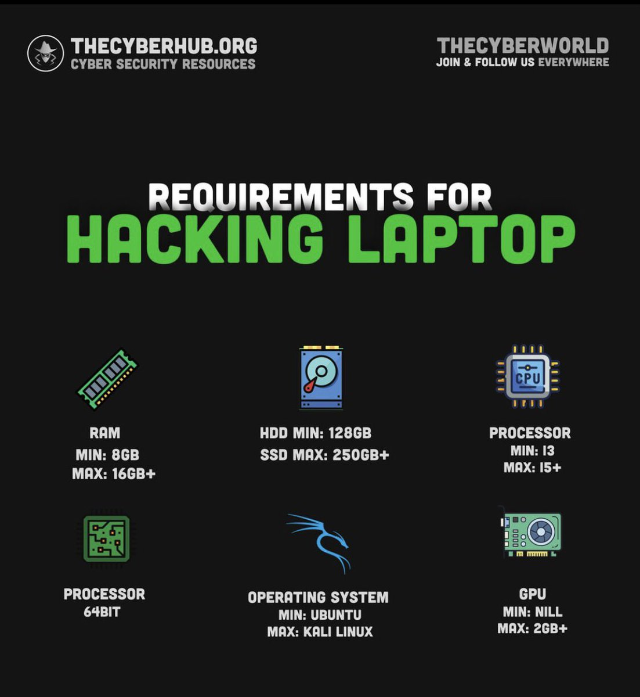

# Cyber Security Roadmap: From Beginner to Advanced

## Disclaimer
This roadmap is designed for educational purposes only. Always use the tools and techniques mentioned here ethically and within legal boundaries.

## Step 1: Foundational IT Knowledge

### Complete CompTIA A+ Certification Syllabus
- **Resources:**
  - [CompTIA 220-1001 A+ Training Course - Professor Messer](https://www.professormesser.com/free-a-plus-training/220-1001/)
  - [CompTIA A+ Certification Video Course - PowerCert Animated Video](https://www.youtube.com/watch?v=2eLe7uz-7CM&list=PL7zRJGi6nMRyRhgssvRah3qcxA7bm3AfF&index=1&t=10s&ab_channel=PowerCertAnimatedVideos)
  **- Complete any related practice questions or exercises.**

### Complete CompTIA Network+ Certification Syllabus
- **Resources:**
  - [CompTIA Network+ N10-007 Training Course - Professor Messer](https://www.youtube.com/playlist?list=PLG49S3nxzAnmpdmX7RoTOyuNJQAb-r-gd)
  - [CompTIA Network+ Certification Video Course - PowerCert Animated Video](https://www.youtube.com/watch?v=vrh0epPAC5w&list=PL7zRJGi6nMRyRhgssvRah3qcxA7bm3AfF&index=2&ab_channel=PowerCertAnimatedVideos)
  **- Complete any related practice questions or exercises.**

### Complete CompTIA Security+ Certification Syllabus

- **Resources:**
  - [CompTIA Security+ SY0-501 Training Course - Professor Messer](https://www.youtube.com/playlist?list=PLG49S3nxzAnkL2ulFS3132mOVKuzzBxA8)
**- Complete any related practice questions or exercises.**

## Step 2: Creating a Home Lab

### Minimum Requirements for Home Lab

### Virtualization Software
- **Install VMware Workstation or VirtualBox**
  - [VMware Workstation](https://www.vmware.com/products/workstation-pro/workstation-pro-evaluation.html)
  - [VirtualBox](https://www.virtualbox.org/)
  

## Step 3: Learn Linux

### Resources
- [Linux for Hackers - NetworkChuck](https://www.youtube.com/playlist?list=PLIhvC56v63IJIujb5cyE13oLuyORZpdkL)
- [Linux for Hackers - DavidBombal](https://www.youtube.com/playlist?list=PLhfrWIlLOoKOs-fjCPHdzD2icF2vORfwK)
- [Linux Basics for Hackers Book by OccupyTheWeb](https://www.amazon.com/Linux-Basics-Hackers-Networking-Scripting/dp/1593278551)
- [Complete Linux Fundamentals Rooms on TryHackMe](https://tryhackme.com/module/linux-fundamentals)

**- Complete any related practice questions or exercises.**

## Step 4: Python for Hackers

### Resources
- [Python for Hackers FULL Course](https://www.youtube.com/watch?v=XWuP5Yf5ILI&ab_channel=RyanJohn)

## Step 5: Get Hands-On with Top Cyber Security Tools

### OSINT Tools
- **Tools:**
  - Maltego
  - Ang-Roc
- **Resources:**
  - [TCM Security OSINT Tutorial](https://www.youtube.com/channel/UCk7v5cUsvYENKOxkV6h1FWA)

### Network Scanning Tools
- **Tools:**
  - netdiscover
  - Angry IP Scanner
  - Advanced IP Scanner
  - nmap
  - rustscan
  - Wireshark
  - tcpdump

### Offensive Tools
- **Tools:**
  - metasploit
  - Aircrack-ng
  - Burp Suite
  - OWASP-ZAP

### Password Cracking Tools
- **Tools:**
  - John the Ripper
  - Hashcat
  - Hydra

### Vulnerability Assessment
- **Tools:**
  - OpenVAS
  - Nessus

### Phishing Tools
- **Tools:**
  - Gophish
  - King Phisher
  - EvilURL
  - BlackEye
  - StormBreaker

### Encryption Tools
- **Tools:**
  - VeraCrypt
  - OpenSSL

### Defensive Tools
- **Tools:**
  - Snort
  - pfSense
  - ClamAV

### Forensics/Reverse Engineering Tools
- **Tools:**
  - Radare2
  - OllyDbg
  - Ghidra
  - x64dbg
  - IDA Pro