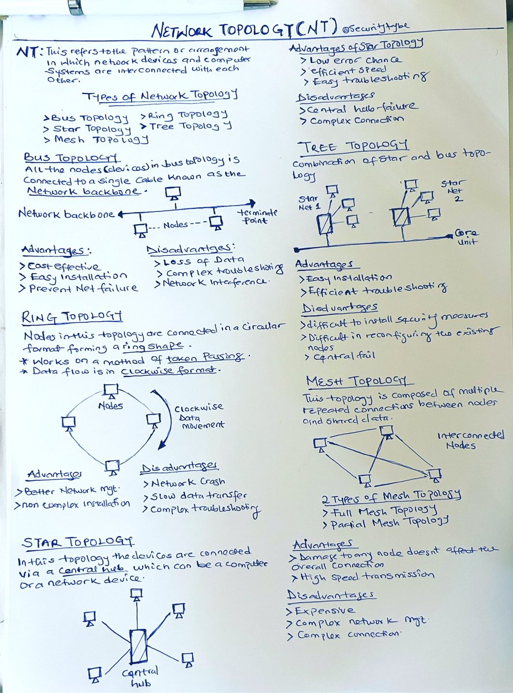
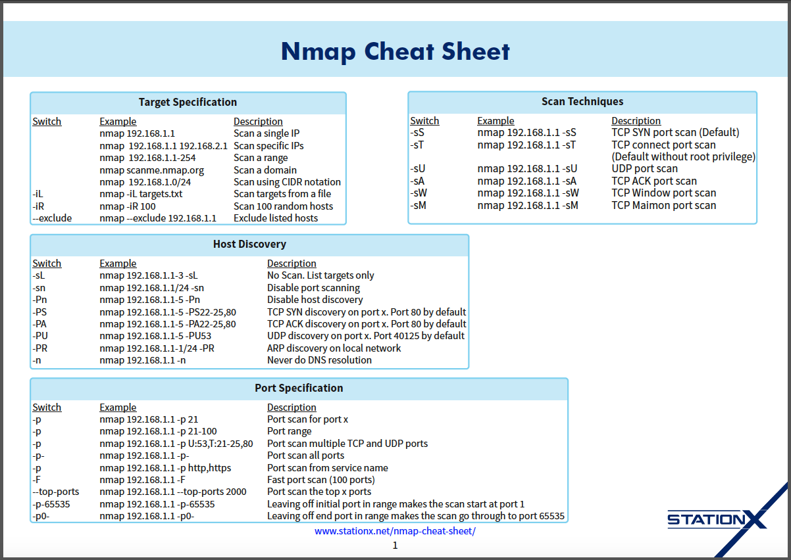

**Disclaimer**

*Warning: Misusing these techniques for malicious purposes like unauthorized access or privacy violations is strictly prohibited and can be illegal.*
*Always act ethically and legally when gathering information.*

**Network Refresher (Basics)**

### Network Scanning

**[Netdiscover](https://github.com/netdiscover-scanner/netdiscover)**

* **Description:** Netdiscover is a pre-installed tool in Kali Linux used to identify live hosts on a network by sending ARP (Address Resolution Protocol) requests and listening for responses.
* **Command:** `sudo netdiscover -r 192.168.186.0/24`
  - `sudo`: Grants superuser privileges for network scanning (check system documentation for details).
  - `netdiscover`: The network scanning tool.
  - `-r 192.168.186.0/24`: Specifies the IP address range to scan using CIDR notation (Classless Inter-Domain Routing).

**[Angry IP Scanner](https://angryip.org/download/)**

* **Description:** Alternative network scanner offering a user interface. Refer to the official documentation for installation and usage: [https://angryip.org](https://angryip.org)

**Check Connectivity**

* **Command:** `ping <ip>` (e.g., `ping 192.168.1.1`)
  - `ping`: The network utility for testing connectivity.
  - `<ip>`: The target IP address to ping.

**[Nmap](https://github.com/nmap/nmap)**

* **Description:** Nmap is a versatile network exploration and security auditing tool.
* **Installation:** `sudo apt-get install nmap` (for Debian-based systems)
  
* **Basic Scan:** `nmap 192.168.186.129` (scans common ports)
* **Port Scanning:**
  - `nmap -p- <ip>`: Scans all ports (TCP and UDP). Exercise caution and refer to nmap documentation for responsible scanning practices: [https://nmap.org/book/port-scanning-tutorial.html](https://nmap.org/book/port-scanning-tutorial.html)
  - `nmap -p <port> <ip>`: Scans a specific port.
* **Timing Options:**
  - `T0-T5`: Scans common TCP ports (faster).
  - `T4`: Faster scan, but less accurate.
  - `T0`: Undetectable (advanced techniques, use with caution).

**Protocol Scanning:**

* **TCP (default):** `nmap <ip>`
* **UDP:** `nmap -sU <ip>`

**Service Version Detection:**

* `nmap -p <port> -sV <ip>` (e.g., `nmap -p 22 -sV 192.168.1.1` for SSH version)

**Script Scanning:**

* `nmap -p <port> -sV -sC <ip>`: Runs default nmap scripts along with version detection.
  - **Example Output:** `ftp-anon: Anonymous FTP login allowed` (indicates anonymous FTP login is possible on the target port).

**OS Detection:**

* `sudo nmap -O <ip>` (attempts to identify the target operating system)

**Aggressive Scan:**

* `sudo nmap -A <ip>`: Performs a comprehensive scan using various techniques (use with caution due to potential network load).

**IP Spoofing**

* **WARNING:** IP spoofing is a technique used in malicious attacks. Use it only for educational purposes in controlled environments.
* **Command:** `sudo nmap -p- -D 10.10.10.100,20.20.20.200,30.30.30.30,40.40.40.40,50.50.50.50 <ip>` (spoofs source IP addresses)
  - Analyze captured packets using Wireshark (network protocol analyzer) to verify spoofing: [https://www.wireshark.org/](https://www.wireshark.org/)
  - **Ethical Considerations:** Spoofing can disrupt network communication. Always obtain permission before scanning any network.

**ARP Scanning (Alternative to Ping):**

* `sudo nmap -sn <ip> -PR` (sends ARP requests to determine active hosts)
  - Use this if ping requests are blocked (e.g., by antivirus software).

**ARP Table:**

* The ARP table maps IP addresses to MAC addresses. Check your system documentation for viewing the ARP table.

**Trace Route:**

* `nmap -sn --traceroute <hostname>` (e.g., `nmap -sn --traceroute facebook.com`)
  - `traceroute`: Traces the route packets take to reach a destination, providing insights into network topology.

**Advanced Nmap Techniques**

* **Scan Specific Protocols:**
  - `nmap -sT <ip>`: TCP scan only.
  - `nmap -sU <ip>`: UDP scan only.
* **Scan a Range of Ports:**
  - `nmap -p 21-25,80 <ip>`: Scans ports 21 to 25 and 80.
* **Exclude Ports:**
  - `nmap -p-!22 <ip>`: Scans all ports except port 22 (SSH).
* **Scan with Custom Timing:**
  - `nmap -T4 <ip>`: Faster scan (less accurate).
* **Save Scan Results:**
  - `nmap -o scan_results.txt <ip>`: Saves output to a file.

## Remaining Network Scanning Techniques

**Host Discovery**

* **`nmap 192.168.186.127/24 -sn`**: Disables port scanning and performs host discovery only using ARP requests.

* **`nmap 192.168.186.131 -p http,https`**: Scans ports based on service names (HTTP and HTTPS in this case).

* **`nmap 192.168.186.131 -F`**: Performs a fast port scan, typically scanning the first 100 ports.

**Service and Version Detection**

* **`nmap 192.168.186.131 -sV`**: Detects services and their versions running on the target host.

* **`nmap 192.168.186.131 -A`**: Enables aggressive scanning, including OS detection, version detection, script scanning, and traceroute.

**OS Detection**

* **`sudo nmap 192.168.186.131 -O`**: Attempts to identify the target operating system by analyzing its TCP/IP stack fingerprint.

**Time-Based Scans**

These refer to different timing templates used by Nmap to control the speed and stealthiness of scans. Refer to the Nmap documentation ([https://nmap.org/book/man-book.html](https://nmap.org/book/man-book.html)) for details on specific timing templates (T0, T1, T2, etc.).

**[Masscan Tool](https://github.com/robertdavidgraham/masscan)**

* **`man masscan`**: Displays the manual page for the `masscan` command-line tool.

* **`sudo masscan 192.168.186.127/24 -p 80,443,23`**: Scans a subnet for specific ports (80, 443, and 23).

* **`sudo masscan 192.168.186.127/24 -p 80`**: Scans a subnet for port 80 (HTTP).

## Python Scripting Examples

These examples showcase various functionalities using Python:

* **System Information** (using `platform` module): Retrieves basic information about the system.

* **Basic Math Operations** (using functions): Performs addition, subtraction, multiplication, and division.

* **Password Generator** (using `random` and `string` modules): Generates a random password of specified length.

* **Web Application Vulnerability Scanner with Nikto** (using `subprocess` module): Executes the Nikto scanner for web application vulnerabilities (remember responsible use).

* **Port Scanner** (using `socket` module): Prompts for target IP, starting and ending ports, and scans for open ports.

* **Version Scanner** (using `socket` module): Prompts for target IP and port, and retrieves version information from the service running on that port.

* **Website Information Gathering** (using `requests` module): Retrieves information like status code, headers, and a snippet of content from a website.

## Nmap Scripting

Nmap Scripting Engine (NSE) allows writing custom scripts (in Lua) to automate network tasks. Here's an overview:

* **Listing NSE Scripts:**
    * `ls -l /usr/share/nmap/scripts`: Lists all NSE scripts.
    * `ls -l /usr/share/nmap/scripts | grep ssh`: Lists scripts containing "ssh" in the filename (likely related to SSH).

* **Editing Scripts:** Use `nano /usr/share/nmap/scripts/<script_name>.nse` to edit an existing script.

* **Running Default Scripts:** `nmap -sC 192.168.186.129` runs default NSE scripts against the target.

* **Running Custom Scripts:** `nmap --script=<script_name>.nse 192.168.186.129` runs a specific NSE script.

**Examples:**

* **FTP Brute-Force Attack:** `nmap --script=ftp-brute.nse -p21 192.168.186.129` (use with caution)

* **HTTP Enumeration:** `nmap --script=http-enum 192.168.186.129`

* **WordPress Detection:** `ls -l /usr/share/nmap/scripts | grep wordpress` (finds scripts related to WordPress)

## Network Scanning Techniques with Nmap Scripting

**Telnet Script:**

   * `ls -l /usr/share/nmap/scripts | grep telnet` (lists scripts containing "telnet")
     * You can then identify the specific script(s) for Telnet scanning based on their descriptions.
   * **Example (assuming a script named `telnet-login.nse`):**
     * `nmap --script=telnet-login.nse 192.168.186.129` (use with caution)
   * **Manual Telnet Connection:** `telnet 192.168.186.129` (if Telnet is allowed on the target)

**SQL Scripts:**

* `ls -l /usr/share/nmap/scripts | grep sql` (lists scripts containing "sql")
* **Example:** `nmap --script=http-sql-injection.nse -p80 testphp.vulnweb.com` (scans for SQL vulnerabilities on a web server, use responsibly on authorized targets only)

**[CVE (Common Vulnerabilities and Exposures) Detection](https://cve.mitre.org/):**

* **Manual Approach:**
    * Clone a vulnerability scanner like `vulscan` using `git clone <vulscan_repository_url>`.
    * Then, run `sudo nmap --script vuln 192.168.186.127` (replace `vuln` with the specific script name if applicable).
* **Nmap Script (vulscan.nse):**
    * `nmap -sV --script=vulscan/vulscan.nse 192.168.186.129` (combines service version detection with vulnerability scanning using the vulscan script)

**PHP Version Detection:**

* `ls -l /usr/share/nmap/scripts | grep php` (lists scripts containing "php")
* **Example:** `nmap --script=http-php-version.nse -p 80 testphp.vulnweb.com` (identifies the PHP version on a web server)

